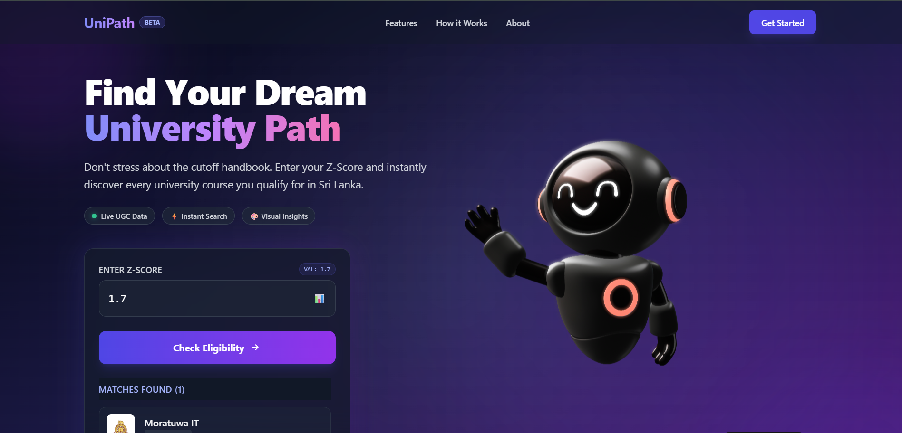

<h1 align="center">UniPath 🚀</h1>

<p align="center">
  A full‑stack web application helping Sri Lankan A/L students visualize their university eligibility based on Z‑Scores.
  <br />
  <a href="#-features"><strong>Features</strong></a> ·
  <a href="#-tech-stack"><strong>Tech Stack</strong></a> ·
  <a href="#-getting-started"><strong>Getting Started</strong></a> ·
  <a href="#-screenshots"><strong>Screenshots</strong></a> ·
  <a href="#-contributing"><strong>Contributing</strong></a>
</p>

<p align="center">
  
  
  
  
  
  
  
  
  
  
</p>

---
## 📸 Screenshots

<p align="center">
  
</p>

## ✨ Features

- Real-Time Eligibility Check: Instantly matches Z‑Scores against university cutoff data.
- 3D Interactive Visuals: Integrated Spline 3D scenes for an immersive user experience.
- University Profiles: Displays university names and logos for eligible courses.
- Modern UI: Tailwind CSS with a clean, glassmorphism-inspired design.

---

## 🛠️ Tech Stack

- Frontend: React.js, Tailwind CSS, Spline (3D), Axios, Vite
- Backend: Django, Django REST Framework, SQLite
- Tools: Pillow (image processing)
- Languages (Repo): Python (96.3%), HTML (1.5%), JavaScript (1.1%), Other (1.1%)

---

## 🚀 Getting Started

Follow these instructions to get a copy of the project running on your local machine.

### Prerequisites

- Python (v3.8+)
- Node.js (v16+)

### 1) Backend Setup (Django)

Open a terminal in the root folder:

```bash
# 1. Navigate to backend
cd backend

# 2. Create virtual environment (if not already created)
python -m venv venv

# 3. Activate virtual environment
# Windows:
..\venv\Scripts\activate
# macOS/Linux:
source ../venv/bin/activate

# 4. Install dependencies
pip install django djangorestframework django-cors-headers Pillow

# 5. Run Migrations
python manage.py migrate

# 6. Start Server
python manage.py runserver
```

Backend runs at: http://127.0.0.1:8000/

If you are using CORS in development, ensure `django-cors-headers` is configured (add `CORS_ALLOWED_ORIGINS = ["http://localhost:5173"]` in `settings.py` and include the middleware).

### 2) Frontend Setup (React)

Open a new terminal in the root folder:

```bash
# 1. Navigate to frontend
cd frontend

# 2. Install dependencies
npm install

# 3. Start the development server
npm run dev
```

Frontend runs at: http://localhost:5173/

---

## 📁 Project Structure (simplified)

```
UniPath/
├─ backend/
│  ├─ manage.py
│  └─ <django_app>/
│
└─ frontend/
   ├─ index.html
   ├─ public/
   │  ├─ unipath-logo.svg
   │  ├─ favicon.svg
   │  └─ screenshots/
   │     ├─ landing.png
   │     └─ results.png
   └─ src/
      ├─ main.jsx
      └─ ...
```

---

## 🔌 API (example)

Your endpoints may vary. Typical patterns:

- GET `/api/eligibility?zscore=<value>` → Returns eligible courses/universities for the given Z‑Score.
- GET `/api/universities` → Returns available universities and metadata.

Document your actual endpoints here once finalized.


## 📄 License

This project is open source. Add a LICENSE file (e.g., MIT) and update this section accordingly.

---

## 🙏 Acknowledgements

- 3D scenes powered by [Spline](https://spline.design/)
- Built with ❤️ using React, Django REST, and Tailwind CSS
